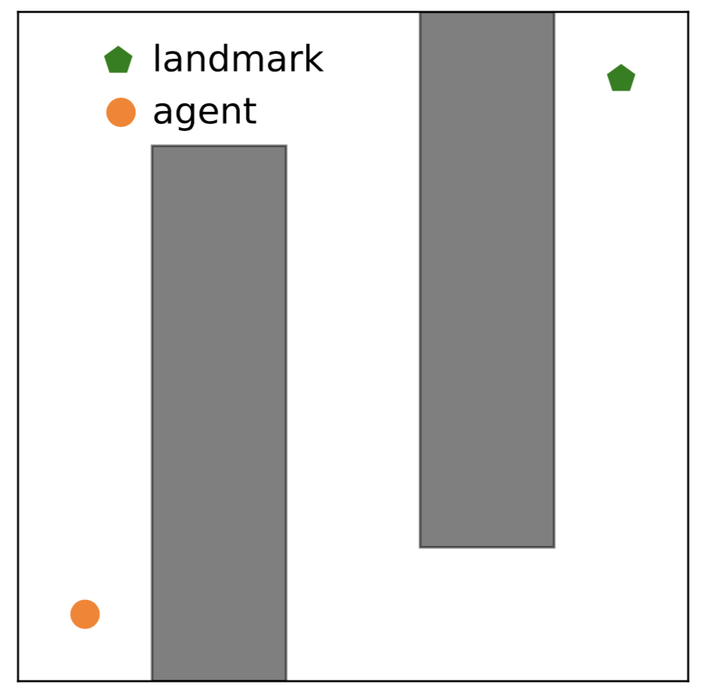
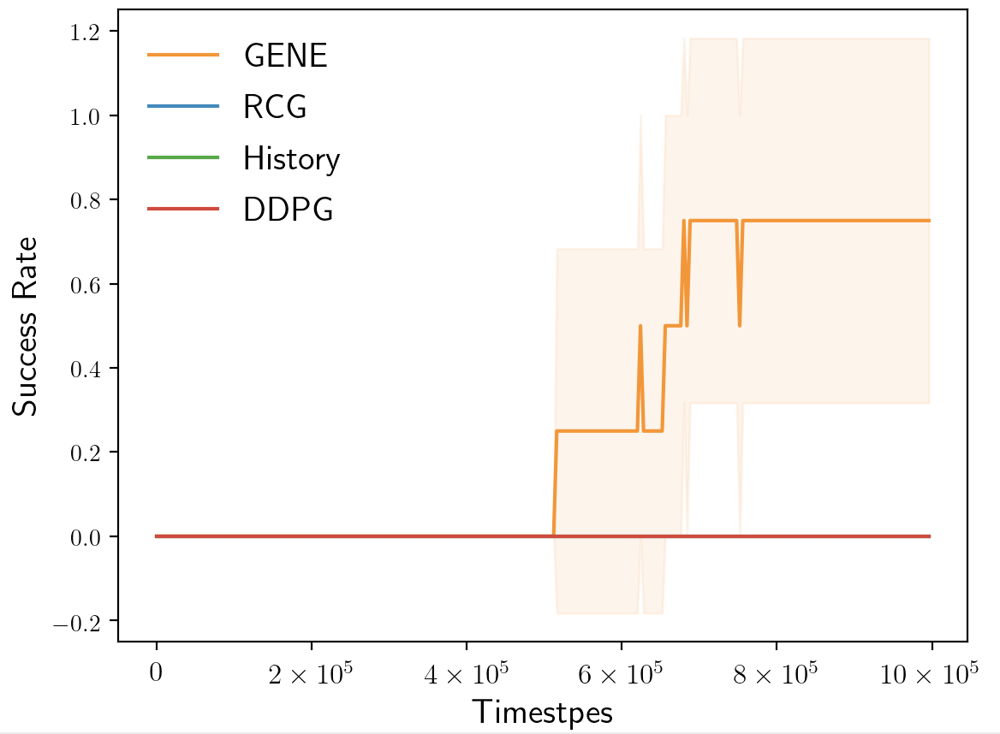

## GENE

This is an improved version of [GENE](https://z0ngqing.github.io/paper/aaai-jiechuan20.pdf). In the original version, the states are generated from the decoder of VAE. We have to check whether the gerenated states are safe or not, which still requires the prior knowledge about the environment. In this version, we select initial states from the history states in memory buffer according to the estimated densities. Also, we replace the rejection sampling with rank-based sampling in PER, which is more practical. When alpha is set to be 0, GENE degrades to History.

We test GENE in the sparse-reward maze task, where the agent learns to reach the landmark. The results are shown in the Figure 1.

## Citation 
If you are using the codes, please cite our paper.

    @inproceedings{jiang2020generative,
      title={Generative Exploration and Exploitation},
      author={Jiang, Jiechuan and Lu, Zongqing},
      booktitle={Proceedings of the AAAI Conference on Artificial Intelligence},
      volume={34},
      number={04},
      pages={4337--4344},
      year={2020}
    }
